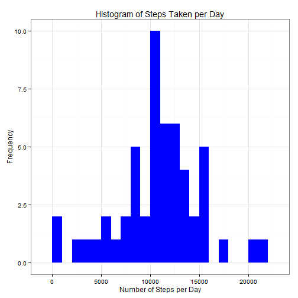
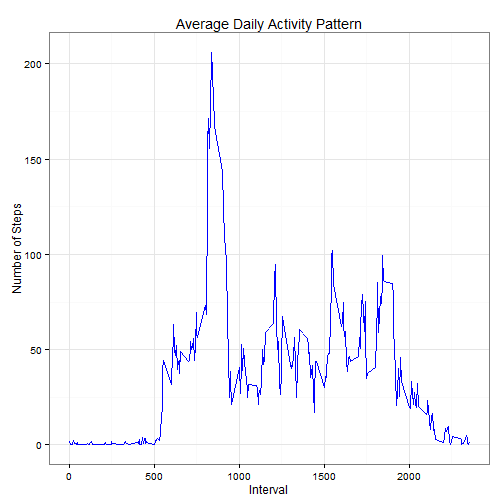
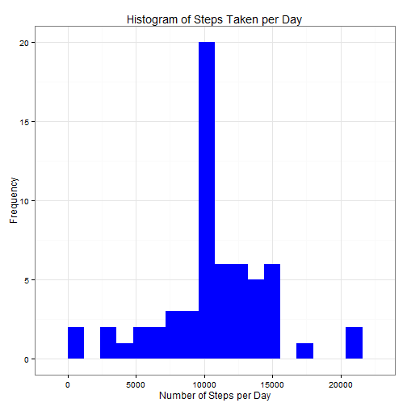

Reproducible Research Peer Assessment Project # 1
=================================================

## Introduction

This document is to present the analysis of data derived from a personal activity monitoring device.

The report was produced utilizing **R markdown** language.

## Assignment

This assignment makes use of data from a personal activity monitoring device. This device collects data at 5 minute intervals through out the day. The data consists of two months of data from an anonymous individual collected during the months of October and November, 2012 and include the number of steps taken in 5 minute intervals each day.

The variables included in this dataset are:

**steps:** Number of steps taking in a 5-minute interval (missing values are coded as NA)

**date:** The date on which the measurement was taken in YYYY-MM-DD format

**interval:** Identifier for the 5-minute interval in which measurement was taken

The dataset is stored in a comma-separated-value (CSV) file and there are a total of 17,568 observations in this dataset.

## Load necessary R libraries


```r
library("dplyr")
library("ggplot2")
library(lattice)
```
 
## Loading and preprocessing the data


```r
setwd("C:/Users/Tim/Documents/R")
activ_data <- read.csv("activity.csv")
activ_data <- tbl_df(activ_data)
```

## What is mean total number of steps taken per day?
Create a histogram to represent the total number of steps taken per day.


```r
steps.day <- aggregate(steps ~ date, data = activ_data, FUN = sum)
ggplot(steps.day, aes(x = steps)) + geom_histogram(fill = "blue", binwidth = 1000) + labs(title = "Histogram of Steps Taken per Day", x = "Number of Steps per Day", y = "Frequency") + theme_bw()
```

 

## Calculate the mean and median of the total number of steps taken per day. 

```r
mean(steps.day$steps)
```

```
## [1] 10766.19
```


```r
median(steps.day$steps)
```

```
## [1] 10765
```


## What is the average daily activity pattern?

Make a time series plot (i.e. type = "l") of the 5-minute interval (x-axis) and the average number of steps taken, averaged across all days (y-axis)


```r
step.day <- aggregate(steps ~ interval, data = activ_data, FUN  = mean)
ggplot(step.day, aes(x=interval, y=steps)) + geom_line(color="blue") + labs(title="Average Daily Activity Pattern", x="Interval", y="Number of Steps") + theme_bw()
```

 


## Which 5-minute interval, on average across all the days in the dataset, contains the maximum number of steps?


```r
step.day$interval[which.max(step.day$steps)]
```

```
## [1] 835
```

The 835th interval.

## Imputing missing values

Calculate and report the total number of missing values in the dataset.


```r
sum(is.na(activ_data))
```

```
## [1] 2304
```

### Create a new dataset that is equal to the original dataset but with the missing data filled in.


```r
fill_na <- function(data, pervalue) {
 na_index <- which(is.na(data$steps))
 na_replace <- unlist(lapply(na_index, FUN=function(idx){
 interval = data[idx,]$interval
 pervalue[pervalue$interval == interval,]$steps}))
 fill_steps <- data$steps
 fill_steps[na_index] <- na_replace
 fill_steps
}

new_data <- data.frame(steps = fill_na(activ_data, step.day), date = activ_data$date, interval = activ_data$interval)
```

Confirm there are no missing values

```r
sum(is.na(new_data$steps))
```

```
## [1] 0
```


## Make a histogram of the total number of steps taken each day and Calculate and report the mean and median total number of steps taken per day.

Create a histogram using similar method as above.


```r
fill.step.day <- aggregate(steps ~ date, new_data, sum)
colnames(fill.step.day) <- c("date", "steps")
ggplot(fill.step.day, aes(x = steps)) + geom_histogram(fill = "blue", binwidth = 1200) + labs(title = "Histogram of Steps Taken per Day", x = "Number of Steps per Day", y = "Frequency") + theme_bw()
```

 

## Calculate the mean and median of the total number of steps taken per day.


```r
mean(fill.step.day$steps)
```

```
## [1] 10766.19
```

```r
median(fill.step.day$steps)
```

```
## [1] 10766.19
```

## Do these values differ from the estimates from the first part of the assignment?
**While the mean remains the same, the median adjusted slightly from 10765 to 10766.19.**
**The impact of removing the missing values has increased the peak of number of steps per day.**


## Are there differences in activity patterns between weekdays and weekends?
### Create a new factor variable in the dataset with two levels - "weekday" and "weekend" indicating whether a given date is a weekday or weekend day.


```r
activ_data$date <- as.Date(activ_data$date, "%Y-%m-%d")
day <- weekdays(activ_data$date)
day_type <- vector()
for (i in 1:nrow(activ_data)) {
    if (day[i] == "Saturday") {
    day_type[i] <- "Weekend"
    } else if (day[i] == "Sunday") {
    day_type[i] <- "Weekend"
    } else {
    day_type[i] <- "Weekday"
}
}
activ_data$day_type <- day_type
activ_data$day_type <- factor(activ_data$day_type)

steps_per_day <- aggregate(steps ~ interval + day_type, data = activ_data, mean)
names(steps_per_day) <- c("interval", "day_type", "steps")

xyplot(steps ~ interval | day_type, steps_per_day, type = "l", layout = c(1, 2), xlab = "Interval", ylab = "Number of steps")
```

 


